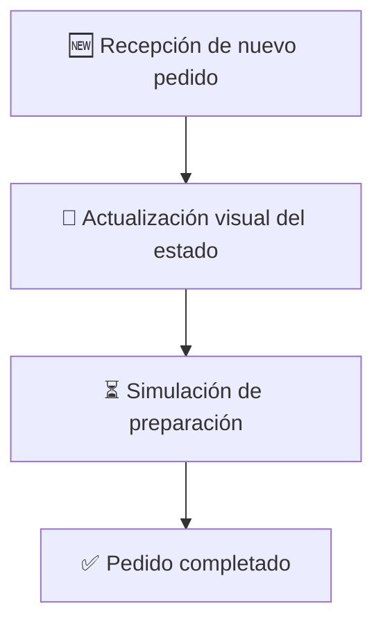

# ☕ Event Loop y Asincronicidad - Simulador de Cafetería

<div align="center">


*Dominando los conceptos fundamentales de JavaScript*

</div>

---

## 🎯 Introducción

> **El Event Loop y la asincronicidad son pilares fundamentales de JavaScript.** Comprender cómo funcionan te permitirá construir aplicaciones eficientes y reactivas, mejorando la experiencia del usuario. Aunque al principio puede ser un concepto complejo, con práctica y paciencia, dominarás estas herramientas esenciales.

## 🎪 Objetivo

Crear una **simulación interactiva** que permita simular algunas actividades en una cafetería:

### 🔄 Funcionalidades Principales

| Número | Funcionalidad | Descripción |
|--------|---------------|-------------|
| 1️⃣ | **Recibir Pedidos** | Reciba nuevos pedidos de clientes |
| 2️⃣ | **Procesamiento Asincrónico** | Procese cada pedido de manera asincrónica con tiempo simulado |
| 3️⃣ | **Actualización en Tiempo Real** | Actualice el estado de cada pedido ('En Proceso' → 'Completado') |

---

## ☕ Problema: Simulador de Pedidos en una Cafetería

<div align="center">

</div>

En una **cafetería moderna**, es común que los clientes realicen pedidos que requieren preparación mientras se reciben nuevos pedidos. Una interfaz debe mostrar los pedidos en progreso, permitir que los baristas trabajen en ellos de manera asincrónica y actualizar el estado de los pedidos en tiempo real. 

### 🚀 El Desafío

El desafío consiste en **simular este sistema** mediante JavaScript, utilizando:

- 🔄 **Event Loop**
- ⏰ **setTimeout**
- 🤝 **Promises**
- ⚡ **async/await**

---

## 📋 Instrucciones para resolver el problema

### 🛠️ 1. Configurar el entorno

| Paso | Descripción |
|------|-------------|
| **1.1** | 📄 Crea un archivo **HTML** con un botón para agregar pedidos y un contenedor para mostrar los pedidos en la interfaz |
| **1.2** | 📜 Crea un archivo **JavaScript** donde desarrollarás la lógica principal |

### 🏗️ 2. Estructura del código

Define funciones que manejen:



- **2.1** 📥 Recepción de un nuevo pedido
- **2.2** 🎨 Actualización visual del estado de los pedidos  
- **2.3** ⏳ Simulación de la preparación de pedidos

### ⚡ 3. Comportamiento del sistema

Cuando el usuario haga clic en **'Agregar Pedido'**:

<div align="center">

```
🖱️ Click → 🆔 ID Único → 📱 Mostrar en Interfaz → ⏰ Tiempo Aleatorio → ✅ Estado "Completado"
```

</div>

| Paso | Acción | Estado |
|------|--------|---------|
| **3.1** | Se generará un pedido con un identificador único | 🆔 |
| **3.2** | Se mostrará en la interfaz con el estado 'En Proceso' | 🟡 |
| **3.3** | Después de un tiempo aleatorio (simulando la preparación), el estado cambiará a 'Completado' | 🟢 |

### 🔧 4. Mecanismos asincrónicos

<table>
<tr>
<td align="center">

**⏰ setTimeout**
```javascript
setTimeout(() => {
  // Simular tiempo de preparación
}, randomTime);
```

</td>
<td align="center">

**🤝 Promises**
```javascript
new Promise((resolve) => {
  // Manejar finalización
});
```

</td>
<td align="center">

**⚡ async/await**
```javascript
async function updateStatus() {
  await prepareOrder();
}
```

</td>
</tr>
</table>

| Mecanismo | Uso | Propósito |
|-----------|-----|-----------|
| **4.1** | `setTimeout` | ⏰ Simular el tiempo de preparación de los pedidos |
| **4.2** | **Promises** | 🤝 Manejar la finalización de los pedidos |
| **4.3** | `async/await` | ⚡ Actualizar el estado en tiempo real |

---

## 📚 Recursos de Referencia

<div align="center">

[](https://gist.github.com/heladio-devf-mx/2c120188609907595b51ed30d5f3f2d0)

*Puedes consultar un extracto de código para comenzar con la solución*

</div>

---

<div align="center">

### 🎊 ¡Comienza tu aventura con JavaScript asincrónico!

*Construye, experimenta y domina el Event Loop* ☕✨

</div>
